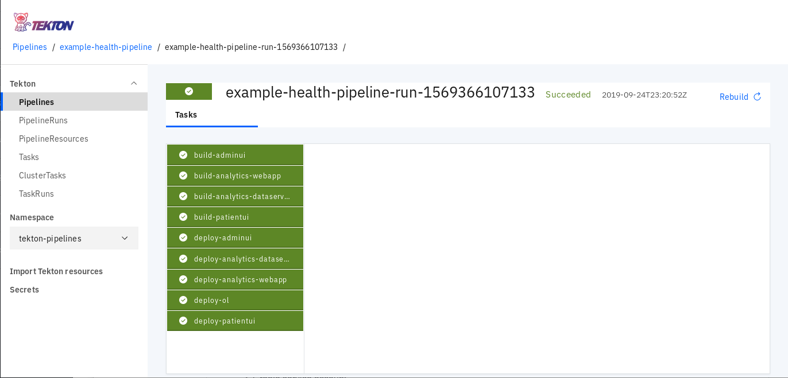
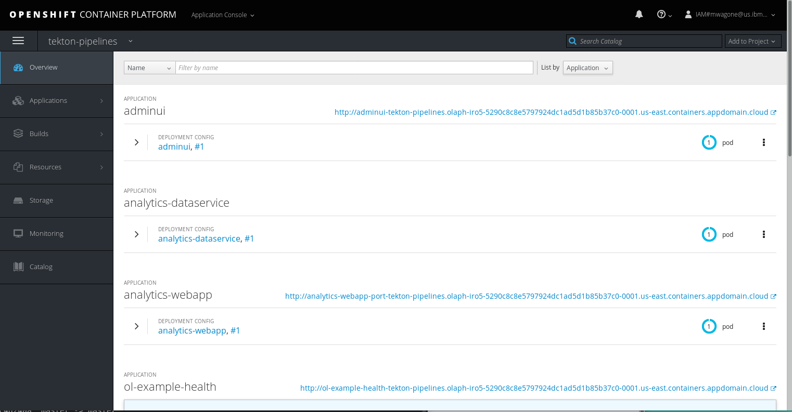

# Using Tekton Pipelines with Red Hat OpenShift on IBM Cloud

## Background

Example Health is a demo app the folks in my group created along with some other folks from the z/OS group.  Initally, it was meant to demonstrate app moderization, but evolved over time to also include analytic capibilities.  Currently, five different images constitute the Example Health app, and we have them all deployed into a single Red Hat OpenShift on IBM Cloud cluster, but anytime the app needs to be deployed in a new cluster the install can take a bit of time.  Thus, the impitus for this project - a tekton pipeline to deploy them all!  Using Tekton has reduced deployment time from 45 minutes of clicking around and configuring down to execution of a few commands and waiting for about 15 minutes.


This pipeline uses several methods for deploying images in OpenShift.  The Patent UI image is constructed from node.js code via OpenShift's Source-to-image functionality; the Admin UI likewise from a php repository.  The two analytics images are also build, but rather via Dockerfiles.  The JEE business logic image is deployed directly from Docker Hub.

## Prerequisties

This tutorial assumes you have a Red Hat OpenShift on IBM Cloud cluster already provisioned.  If not, you can create one via the [IBM Cloud web console](https://cloud.ibm.com/kubernetes/catalog/cluster/create?platformType=openshift) or using the `ibmcloud` CLI.  When using the latter, this [tutorial](https://cloud.ibm.com/docs/openshift?topic=openshift-openshift_tutorial#openshift_create_cluster) may come in handy.

You will also need a few CLIs, including `kubectl` and `oc`.  You can get them [here](https://www.okd.io/download.html)

## Steps

1. Target your cluster
2. Install Teckton, Dashboard, and extensions
3. Create service account
4. Install Tasks
5. Apply resources, pipeline and run

### 1. Target your cluster

Login to cloud.ibm.com and go to the overview page for your openshift cluster. Click on the **OpenShift web console** button in the upper right.  Once on your web console, select the dropdown from the upper right corner (the label contains your email address), and select **Copy Login Command**.  Paste this into your local console window.  It should resemble:

```
$ oc login https://c100-e.us-east.containers.cloud.ibm.com:XXXXX --token=XXXXXXXXXXXXXXXXXXXXXXXXXX
```

### 2. Tekton install

```bash
$ kubectl apply --filename https://storage.googleapis.com/tekton-releases/previous/v0.5.2/release.yaml
$ kubectl apply --filename https://storage.googleapis.com/tekton-releases/dashboard/previous/v0.1.1/release.yaml
```

### 3. Create service account

To make sure the pipeline has the appropriate permissions to store images in the local OpenShift registry, we need to create a service account.  We'll call it 'pipeline':

```bash
$ oc create serviceaccount pipeline
$ oc adm policy add-scc-to-user privileged -z pipeline
$ oc adm policy add-role-to-user edit -z pipeline
```

### 4. Install Tasks

Tekton Pipelines generally are constructed of individual tasks.  We will be using a couple of tasks maintained by the both the Tekton and OpenShift communities: `openshift-client` allows you to execute CLI commands against your OpenShift cluster, and the `s2i-node` and `s2i-php` tasks are responsible for building images via OpenShift's source-to-image functionality.  To install:

```bash
$ oc create -f https://raw.githubusercontent.com/tektoncd/catalog/master/openshift-client/openshift-client-task.yaml
$ oc create -f https://raw.githubusercontent.com/openshift/pipelines-catalog/master/s2i-nodejs/s2i-nodejs-task.yaml
$ oc create -f https://raw.githubusercontent.com/openshift/pipelines-catalog/master/s2i-php/s2i-php-7-task.yaml

```

### 5. Apply resources, pipeline and run

Now we just need to apply a couple of files to the cluster.  The first, 'example-health-resources' defines the location of the github repositories and the names we will use for the images we create as they are stored in the registry.  As you can probably guess, the `example-health-pipeline` files defines all the steps of our pipeline: building, deploying and exposing our images.

**Note**: While the Patient and Admin UI parts of the Example Health application work out-of-the-box, the Analytics section needs futher information to fully function. You need to edit `example-health-pipeline.yaml` and provide a Mapbox [access token](https://www.mapbox.com/account/access-tokens), the name of your cluster, and your hash (found in the URL of your dashboard) and Mongo datalake credentials. See the Analytics [repo](https://github.com/IBM/example-health-analytics) for more details. You also need to expose the ports in the **analytics** services to their routes once the cluster is set up.

```bash
$ git clone https://github.com/loafyloaf/example-health-pipeline.git
$ cd example-health-pipeline
$ kubectl apply -f example-health-resources
$ kubectl apply -f example-health-pipeline
```

You can then use the tekton dashboard to run your pipeline by selecting the **Example Health Pipeline** from the list of pipelines and then clicking the **Create Pipeline Run** button in the upper right. 

Once created, you can follow along with the progress of your pipeline run.  Success looks similar to:



Back in your web console, you can see the URLs for your applications listed in the overview:


